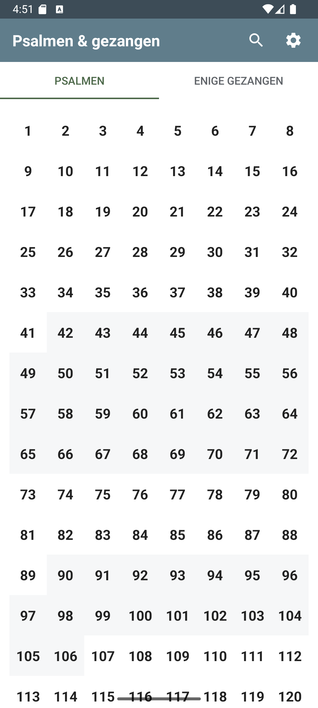
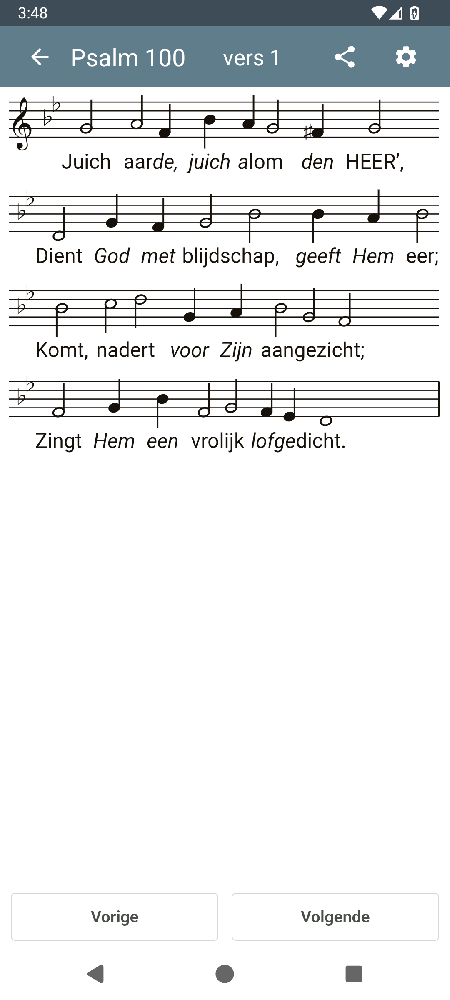

# Psalmverzen met bladmuziek

**Psalmen & Gezangen** is een Android-applicatie ontworpen voor muzikanten en iedereen die graag psalmen en de enige gezangen zingt met volledige ondersteuning voor bladmuziek.

## Belangrijkste Kenmerken

### 🎵 Bladmuziek & Tekst in één oogopslag
Lees de tekst en de noten tegelijkertijd. De app is geoptimaliseerd voor leesbaarheid op mobiele apparaten, zodat je nooit meer hoeft te schakelen tussen tekst en muziek.

### 🔍 Zoom & Schaalbaarheid
Dankzij de ondersteuning voor knijpgebaren (pinch-to-zoom) kun je zowel de bladmuziek als de tekst traploos vergroten of verkleinen. Of je nu een groot tablet of een kleine telefoon gebruikt, de weergave past zich altijd aan jouw voorkeur aan.

### 🎹 Transponeren
Moeite met een te hoge of lage toonsoort? Transponeer de bladmuziek eenvoudig een aantal halve tonen omhoog of omlaag. De noten en de bijbehorende tekst schalen automatisch mee.

### ⚙️ Uitgebreide Configuratie
Personaliseer de app volledig naar jouw wens via het instellingenmenu:
- **Weergavemodi:** Kies uit 'Alleen tekst', 'Alleen noten' of 'Beide'.
- **Donker Thema:** Ondersteuning voor een donker thema, inclusief een speciale 'donkere bladmuziek' modus voor gebruik in omgevingen met weinig licht.
- **Tekstinstellingen:** Grote letters, regelafbreking toestaan, tekstuitlijning (links, gecentreerd, vullend).
- **Scherm aan laten:** Voorkom dat je scherm uitgaat terwijl je aan het zingen of spelen bent.

### 📱 Gebruiksgemak
- **Snel Navigeren:** Veeg horizontaal om direct naar het vorige of volgende vers te springen.
- **Vers-Matrix:** Een handig raster om razendsnel tussen verschillende verzen van een psalm te schakelen.
- **Volledig Scherm:** Dubbeltik op de muziek of tekst om alle balken te verbergen en de volledige focus op de muziek te leggen.

## Screenshots

| Hoofdscherm | Bladmuziek Weergave |
|:---:|:---:|
|  |  |

## Ontwikkeling
Dit project is gebouwd met de volgende Android-technieken:
- **Kotlin** voor robuuste logica.
- **WebView & JavaScript** voor hoogwaardige, dynamische weergave van bladmuziek via MusicXML.
- **Jetpack Libraries** voor een soepele gebruikerservaring.

## Licentie
Dit project is bedoeld voor persoonlijk-  en gemeenschapsgebruik.
