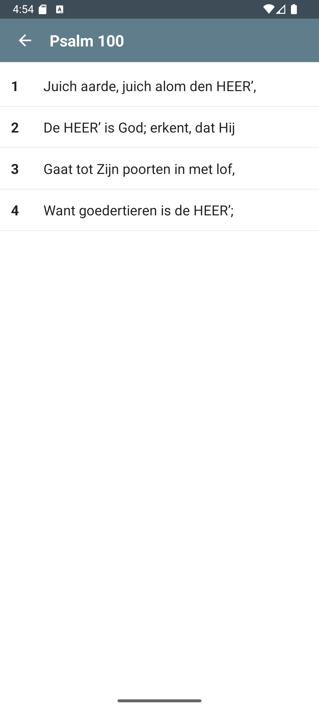
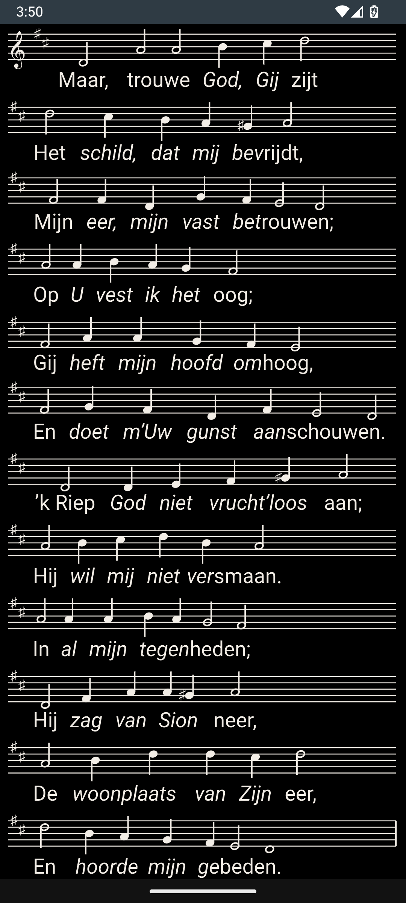
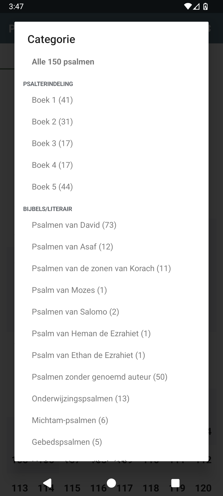
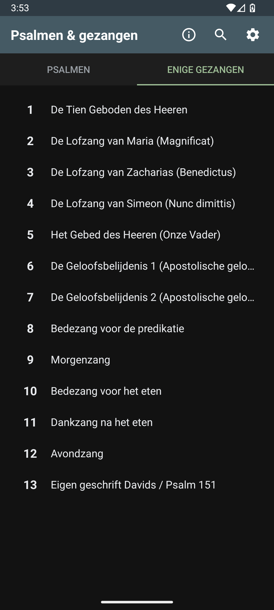
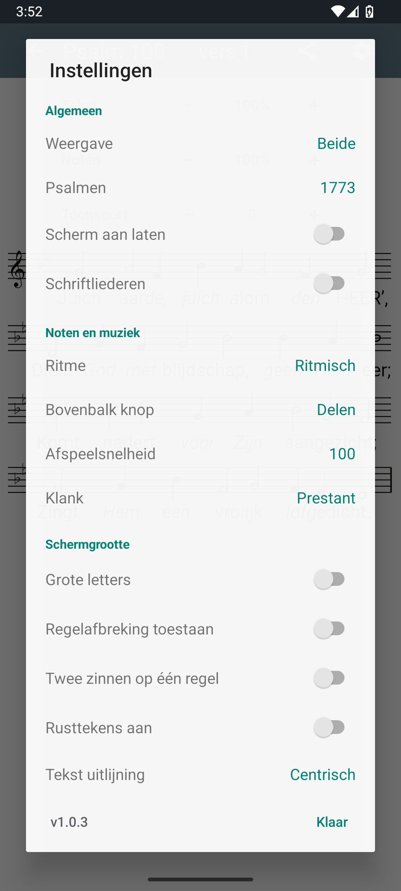
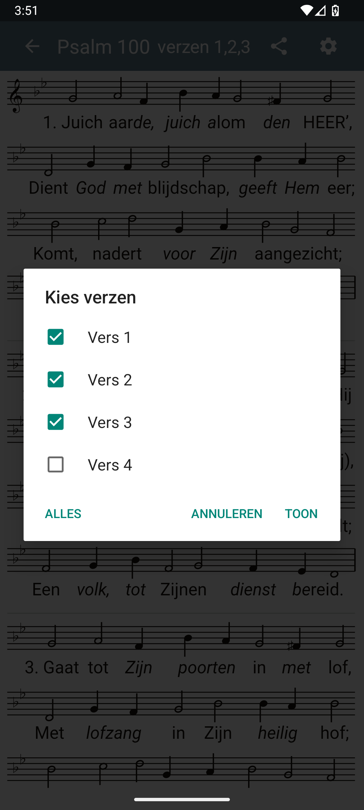
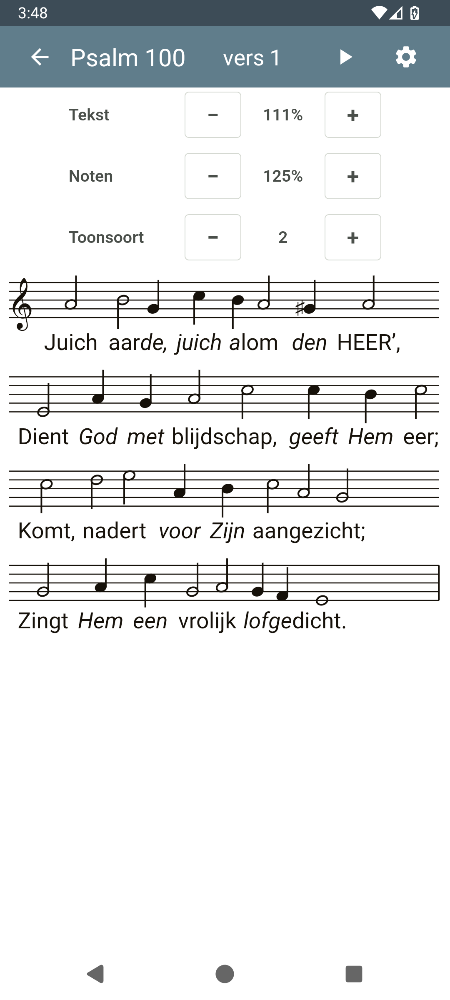
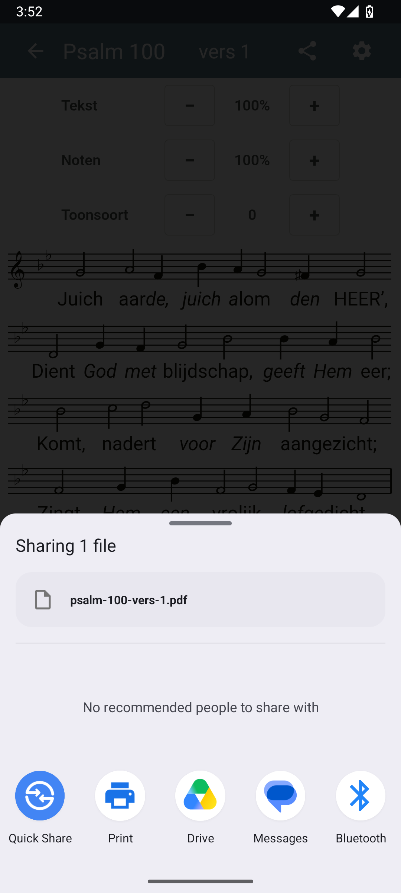

# Psalmverzen met bladmuziek

**Psalmverzen met bladmuziek** is een Android-app voor muzikanten en iedereen die graag psalmen en gezangen zingt met tekst en noten in één rustige, leesbare weergave.

## Belangrijkste Kenmerken

### 🎵 Bladmuziek & Tekst in één oogopslag
Lees de tekst en de noten tegelijkertijd. De app is geoptimaliseerd voor leesbaarheid op mobiele apparaten, zodat je de tekst en noten op 1 scherm kan zien.

### 🔍 Zoom & Schaalbaarheid
Dankzij de ondersteuning voor knijpgebaren (pinch-to-zoom) kun je zowel de bladmuziek als de tekst traploos vergroten of verkleinen. Of je nu een groot tablet of een kleine telefoon gebruikt, de weergave past zich altijd aan jouw voorkeur aan.

### 🎹 Transponeren
Moeite met een te hoge of lage toonsoort? Transponeer de bladmuziek eenvoudig een aantal halve tonen omhoog of omlaag. De noten en de bijbehorende tekst schalen automatisch mee.

### ▶️ Mini-speler voor melodie
Beluister de melodie direct in het bladmuziekscherm via de afspeelknop in de bovenbalk. De speler werkt live (zonder losse audiobestanden) en volgt de noten uit de huidige melodiedata.
- **Play/Stop in de bovenbalk:** start of stop de melodie met één tik.
- **Transpositie inbegrepen:** wat je ziet na transponeren, hoor je ook terug.
- **Meerdere verzen:** bij gestapelde verzen speelt de app ze achter elkaar af met een korte adempauze.
- **Klankkeuze:** kies uit een gesimuleerde orgel registers.
- **Tempo-instelling:** regel de afspeelsnelheid van 50% tot 150%.

### 🔎 Zoeken
Zoek snel door alle psalm- en gezangverzen. De resultaten tonen direct de regel waarin de match voorkomt, zodat je meteen ziet waarom een vers gevonden is.

### 📚 Meerdere verzen (long-press)
Houd in het bladmuziekscherm het verslabel ingedrukt om meerdere verzen van dezelfde psalm of hetzelfde gezang te selecteren. Handig voor doorlopend zingen of (af)spelen van meerdere verzen achter elkaar.

### ⚙️ Uitgebreide Configuratie
Personaliseer de app volledig naar jouw wens via het instellingenmenu:
- **Weergavemodi:** kies uit tekst met noten, alleen tekst of alleen noten.
- **Psalmberijmingen:** wissel tussen de volgende berijmingen 1773 (oude berijming), Datheen, Revius en Marnix; 1773 is de standaard. Alle vier gebruiken dezelfde Geneefse melodieën.
- **Ritme:** toon de melodieën ritmisch of iso-ritmisch.
- **Bovenbalk-knop (portret):** kies of de knop delen of afspelen; in landscape zijn delen en afspelen beide zichtbaar.
- **Afspeelinstellingen:** stel tempo en klank van de melodie-speler in.
- **Donker Thema:** Ondersteuning voor een donker thema, inclusief een speciale 'bladmuziek donker' modus waarbij bladmuziek op een witte achtergrond blijft.
- **Tekstinstellingen:** grote letters, regelafbreking toestaan, tekstuitlijning (links, gecentreerd, vullend), twee zinnen op één regel en optionele rusttekens.
- **Scherm aan laten:** Voorkom dat je scherm uitgaat terwijl je aan het zingen of spelen bent.

### 📱 Gebruiksgemak
- **Snel Navigeren:** Veeg horizontaal om direct naar het vorige of volgende vers te springen.
- **Vers-Matrix:** Een handig raster om snel tussen verschillende verzen van een psalm te schakelen.
- **PDF delen:** Deel of print het huidige vers als A4-PDF met alleen notenbalk en tekst.
- **Psalm Categorieën:** Tik op de titel 'Psalmen en gezangen' om de 150 psalmen te filteren op een van 35 categorieën, ingedeeld in Psalterindeling, Bijbels/literair, Thema en Gebruik. Tik op ⓘ voor een uitgebreide toelichting per categorie.
- **Volledig Scherm:** Dubbeltik op de muziek of tekst om alle balken te verbergen en de volledige focus op de muziek te leggen.

## Screenshots

| **1. Hoofdscherm** | **2. Psalm selectie** |
|:---:|:---:|
|  |  |
| **3. Bladmuziek** | **4. Donkere modus** |
|  |  |
| **5. Categorie** | **6. Enige Gezangen** |
|  |  |
| **7. Instellingen** | **8. Meerdere verzen** |
|  |  |
| **9. Transpose** | **10. Print/share mogelijkheid** |
|  |  |

## Ontwikkeling
Dit project is gebouwd met de volgende Android-technieken:
- **Kotlin** voor app-logica, instellingen, navigatie en contentselectie.
- **View-gebaseerde Android UI** met AppCompat/Material-componenten.
- **Eigen SVG-renderer in een WebView** voor de dynamische bladmuziekweergave. De app gebruikt hiervoor compacte JSON-assets met melodie- en tekstdata.
- **Gebundelde content-assets** voor psalmen, gezangen, meerdere psalmberijmingen en gedeelde melodieën.

## Licentie
Dit project is bedoeld voor persoonlijk- en gemeenschapsgebruik. Neem gerust contact op via de GitHub-pagina, persoonlijk contact of middels een Play Store review voor toevoegingen of verbeter suggesties.

## Playstore
[Link naar de Google Play Store](https://play.google.com/store/apps/details?id=nl.psalmbladmuziek.app)
